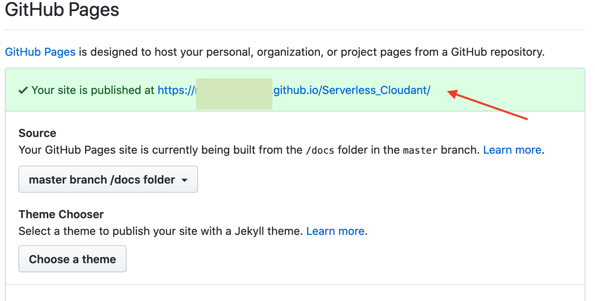

# Comentarios en vivo (API sin servidor).
[![IBM Cloud powered][img-ibmcloud-powered]][url-ibmcloud]

Creará una aplicación web sin servidor alojando contenido de sitio web estático en GitHub Pages e implementando el programa de fondo de la aplicación mediante IBM Cloud™ Functions.

En lugar de suministrar una máquina virtual, un contenedor o un entorno de ejecución de Cloud Foundry para desplegar el programa de fondo, puede implementar la API de programa de fondo con una plataforma sin servidor. Esta puede ser una buena solución para evitar pagar por el tiempo de desocupación y dejar la plataforma se escale cuando sea necesario.

# Functions de IBM Cloud
Plataforma de IBM cloud de programacion poliglota FaaS (Functions-as-a-Service) para desarrollo de codigo ligero que escala dependiendo de la demanda.

Para mayor informacion: [![Functions][img-cloud-functions]][url-ibmcloud-Functions]

## IBM Developer Advocates Team

Módulo: Serverless	
Agenda
* [Prework](#Prework)
* [Crear y configurar Cloudant DB](#Crear-y-configurar-Cloudant-DB)
* [Configuración de Functions](#Configuración-de-Functions)
* [Configuración de API](#Configurar-el-API)
* [Despliegue de Aplicación](#Despliegue)


## Prework:
* Cuenta de [IBM Cloud][url-IBMCLOUD]
* Instalar [CLI de IBM Cloud][url-CLI-IBMCLOUD] 
* Cuenta en [GitHub][url-github-join]
* Instalar [CLI de GitHub][url-github-cli] o instalar [GitHub Desktop][url-githubdesktop]
* Instalar [NodeJS][url-node]
* Utilizar safari, chrome, firefox, edge

## Cupones para profesores y estudiantes:

* Acceder al portal de [IBM Academic Initiative][url-academic] y seleccionar la opción "Register now" si aun no tienes cuenta.
* Realizar el registro correspondiente utilizando la cuenta de correo académica y confirma tu cuenta.
* Despues de confirmar tu cuenta, y con la sesion iniciada en IBM Academic Initiative, en la parte de "Most Popular Topics covered", encontraremos **IBM Cloud** y damos click en "Learn more".
* Bajamos de la pagina hasta encontrar "Software". Le damos click, nos dara un apartado que se llama "Request Feature Code".
* Nos dara nuestro codigo. Lo copiamos y lo llevamos a **IBM Cloud**.

## Cargar créditos en IBM Cloud:

* En la parte superior derecha, buscaremos la parte de "MANAGE"/"GESTIONAR", nos desplegara una lista y seleccionaremos "Account"/"Cuenta".
* De lado izquierdo, tendremos una opción "Account settings"/"Configuracion de cuenta".
* Bajamos un poco hasta encontrar "Subscription and feature codes"/"Codigos de suscripción y carateristicas".
* Da click en "Apply code"/"Aplicar codigo".
* Ingresamos el codigo y click en "Apply"/"Aplicar".

[url-academic]: https://my15.digitalexperience.ibm.com/b73a5759-c6a6-4033-ab6b-d9d4f9a6d65b/dxsites/151914d1-03d2-48fe-97d9-d21166848e65/home/
[url-onthehub]: https://onthehub.com/ibm/?utm_sourc=ibm-ai-productpage&utm_medium=onthehubproductpage&utm_campaign=IBM
[url-IBMCLOUD]: https://cloud.ibm.com/registration
[url-CLI-IBMCLOUD]: https://cloud.ibm.com/docs/cli/reference/ibmcloud?topic=cloud-cli-install-ibmcloud-cli
[url-github-join]: https://github.com/join
[url-github-cli]: https://git-scm.com/book/en/v2/Getting-Started-Installing-Git
[url-githubdesktop]: https://desktop.github.com/
[url-node]: https://nodejs.org/es/download/


## Crear y configurar Cloudant DB:
1.De nuestro catálogo en cloud.ibm.com buscamos Cloudant. 

 
2.Seleccionamos Cloudant. 

 
3.Lo nombramos comentarios-db, seleccionamos Legacy Credentials y IAM, posteriormente creamos una instancia del servicio. 

 
4.Ya que el servicio este desplegado y listo para usar, en el tab de “Service Credentials” buscarmo si ya tenemos alguna creada, si no es asi, generamos una nueva credencial, que usaremos más adelante. 
 
 
5.Volvemos a la tab de "Manage" y le damos click en “Launch cloudant dashboard”. 
 
6.Nos vamos a la tab de lado izquierdo, damos click en "Create Database" y la nombramos "guestbook". 
  

## Configuración de Functions
En esta sección configuraremos nuestro servicio de Functions.
1. Secuencia de acciones para escribir a la base de datos
	1. Vamos al catálogo y buscamos **Cloud Functions**. 
	 
 	2. Una vez dentro seleccionamos "Actions". 
	  
	3. Damos click en "Create". 
	 
	5. Ponemos el nombre "prepara-dato-para-salvar" y seleccionamos "Node.js 12" como el Runtime, damos click en "Create". 
	 
	6. Cambiamos el código por el siguiente:
		``` js
		function main(params) {
		 if (!params.nombre || !params.comentario) {
		  return Promise.reject({ error: 'no nombre or comentario'});
		  }
		 return {
		  doc: {
		   createdAt: new Date(),
		   nombre: params.nombre,
		   correo: params.correo,
		   comentario: params.comentario
		  }
		 };
	 	}
		```
	7. Lo salvamos. 
	 
	8. Para añadir nuestra acción a una secuencia primero nos vamos al tab “Enclosing Secuences” y damos click en “Add to Sequence”.
	 
	 
 	9.	Para el nombre de la secuencia ponemos "guardar-comentario-secuencia" y posteriormente damos click en "Create and Add". 
	 
	10.	Una vez que esta creada nuestra secuencia le damos click al nombre de la secuencia "save-guestbook-entry-sequence" y posteriormente damos click en "Add". 
	 
 	11.	Damos click en "Use Public" y seleccionamos "Cloudant". 
	 
 	12.	Seleccionamos la acción "create-document", damos click en "New Binding", ponemos de nombre de nuestro paquete "enlace-para-comentarios" y en "Instance" seleccionamos "Input Your Own Credentials". 
	 
 	13.	 Nos desplegara una lista. Para llenar estos datos copiamos las credenciales que tenemos en nuestro servicio de "Cloudant" y damos click en "Add", lo llenamos de la siguiente manera: 
	 
 	14.	Para probar que esté funcionando, damos click en "save" y luego en "change input" e ingresamos nuestro siguiente JSON y damos click en Apply y luego en Invoke
	 ``` json
		{
		"nombre": "Jorge Perez",
		"correo": "jorge@perez.com",
		"comentario": "Felicidades!!"
		}
	```
	Una vez hecho esto y nos de una id de activacion correcta, podremos verlo escrito en nuestra base de datos de "Cloudant", en el "Dashboard", en la sección "Documents" 
	 
	 
	 
2. Secuencia de acciones para obtener las entradas de la base de datos
Esta secuencia la usaremos para tomar las entradas de cada usuario y sus respectivos comentarios, regresemos a "Functions/Actions".
 
 
	1.	En nuestra tab de functions creamos una nueva acción Node.js y le ponemos el nombre "inicio-leer-comentario", siguiendo el mismo proceso que en la acción anterior. 
	 
	 
	 
	2.	Reemplazamos el código que viene, esta acción pasa los parámetros apropiados a nuestra siguiente acción:
		``` js
		function main(params) {
		 return {
		  params: {
		   include_docs: true
		   }
		 };
		}
		```
	3. Damos click en "Save" y click en "Enclosing Sequences". 
	 
	4. Damos "Add to Sequence" y "Create New" con el nombre "leer-comentarios-secuencia", y damos click en "Create and Add".
	 
	 
	5. Damos click en el nombre de la secuencia "leer-comentarios-secuencia".
 	6. Damos click en "Add" para crear una segunda acción en la secuencia.
	7. Seleccionamos "Public" y "Cloudant".
 	8.	Seleccionamos "list-documents" en actions y seleccionamos el binding "enlace-para-comentarios" y posteriormente damos click en "Add". 
	 
 	9.	Damos click en "Save" y luego en "Add" para añadir una acción más a la secuencia, esta es la que va a dar el formato de los documentos cuando regresen de Cloudant.
	10.	La nombraremos "formato-comentarios" y posteriormente damos click en "Create and add". 
	  
	11.	Damos click en "Save" y luego en nuestra accion "formato-comentarios" y reemplazamos el código con:
		``` js
		const md5 = require('spark-md5');
			
		function main(params) {
		 return {
		  entries: params.rows.map((row) => { return {
		   nombre: row.doc.nombre,
		   correo: row.doc.correo,
		   comentario: row.doc.comentario,
		   createdAt: row.doc.createdAt,
		   icon: (row.doc.correo ? `https://secure.gravatar.com/avatar/${md5.hash(row.doc.correo.trim().toLowerCase())}?s=64` : null)
		  }})
		 };
		}
		```
	12.	Salvamos y regresamos a nuestra secuencia para correrla con "invoke" (Esto lo podemos hacer dando click en acciones, y luego en nuestra secuencia, o en "Enclosing Sequence" y luego en nuestra secuencia). 
	 
	 
 
## Configurar el API
1.	Dentro de nuestras acciones seleccionamos ambas secuencias y en la tab de "Endpoints" damos click en "Enable Web Action" y damos click en "Save". **Es importante que se haga para cada secuencia**. 
 
 
Y nos quede de la siguiente manera: 
 
2.	Nos vamos a el tag "APIs" que esta de lado derecho.
3.	Damos click en "Create API". 
 
4.	En el "API name *" ponemos "guestbook" y en el "Base path for API *" ponemos "/guestbook" y damos click en "create operation".
 
  
5.	Creamos un "Path *" que sea "/entries" ponemos el verbo a "GET" y seleccionamos la secuencia "leer-comentarios-secuencia" y damos click en "Create". 
 
6.	Realizamos la misma acción pero ahora con un "POST" y la secuencia "guardar-comentarios-secuencia" y damos click en "Create".
 
 
7.	Nos dirigimos hasta abajo y damos click en "Create" para exponer la API. 
 
 
## Despliegue
1.	Forkeamos y despues clonamos este repositorio en alguna carpeta de facil acceso. 
 
``` bash
git clone <url de tu nuevo repositorio>
```
2.	Modificamos el "docs/guestbook.js" y reemplazamos el valor de "apiUrl" en la linea 6 con la ruta dada por el "API Gateway", que obtenemos al dar click en nuesta API. 
 
 
3.	Guardamos el archivo modificado y hacemos "push" de esto al repositorio que habiamos clonado.
``` bash
git add .
git commit -m "nuevo commit"
git push
```
4.	En el área de Settings>Github Pages, seleccionamos "master branch/docs folder. 
 
 
5.	Y podemos entrar a nuestra página en el link que aparece ya que nos diga que el sitio esta publicado. 
 


[url-ibmcloud]: https://www.ibm.com/cloud/
[img-cloud-functions]: https://img.shields.io/badge/IBM%20cloud-Functions-red.svg
[url-ibmcloud-Functions]: https://www.ibm.com/cloud/functions
[url-IBMCLOUD]: https://cloud.ibm.com/registration
[url-CLI-IBMCLOUD]: https://cloud.ibm.com/docs/cli/reference/ibmcloud?topic=cloud-cli-install-ibmcloud-cli
[url-github-join]: https://github.com/join
[url-github-cli]: https://git-scm.com/book/en/v2/Getting-Started-Installing-Git
[url-githubdesktop]: https://desktop.github.com/
[img-ibmcloud-powered]: https://img.shields.io/badge/IBM%20cloud-powered-blue.svg
